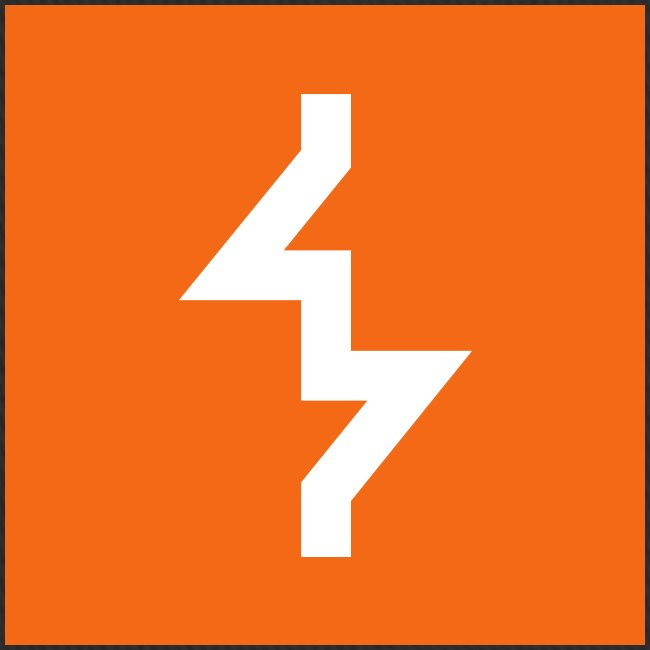

<h1 align="center">Hi 👋, I'm Hajar Ed-darrajy </h1>
<h3 align="center">a Cyber Security Engineering student</h3>

  

  

- 👨‍🎓 Fourth-year student in Cyber Defense Engineering at ENSA Marrakech, also a CTF player💻 

- 🌟 Motivated, results-oriented, and passionate about cybersecurity, with a strong foundation in the field 

- 🚀 Actively seeking a dynamic team where I can leverage my skills in the context of my summer internship. 

- 🌱 Always eager to learn and grow. 

- 📫 How to reach me **hajareddarrajy@gmail.com** 

 

   

<h3 align="left">Connect with me:</h3>

<h3 align="left">Languages and Tools:</h3>

<table align="center">
  <tr>
    <td align="center" width="90">
      
       React
    </td>
    <td align="center" width="90">
      
       Kali
    </td>
    <td align="center" width="90">
      
       Node.js
    </td>
    <td align="center" width="90">
        
         Bash
      </td>
      <td align="center" width="90">
        
         PHP
      </td>
      <td align="center" width="90">
        
         Python
      </td>
  </tr>
  <tr>
    <td align="center" width="90">
      
       HTML
    </td>
    <td align="center" width="90">
      
       CSS
    </td>
    <td align="center" width="90">
      
       Bootstrap
    </td>
    <td align="center" width="90">
        
         firebase
    </td>
    <td align="center" width="90">
        
         wireshark
    </td>
    <td align="center" width="90">
        
         Git
    </td>
  </tr>
  <tr>
    <td align="center" width="90">
      
       MySQL
    </td>
    <td align="center" width="90">
      
       Java
    </td>
    <td align="center" width="90">
      
       C++
    </td>
    <td align="center" width="90">
        
         C
    </td>
    <td align="center" width="90">
        
         virtualbox
    </td>
    <td align="center" width="90">
        
         vmware
    </td>
  </tr>
  <tr>
    <td align="center" width="90">
        
         latex
    </td>
    <td align="center" width="90">
        
         Django
      </td>
    <td align="center" width="90">
        
         npm
    </td>
    <td align="center" width="90">
        
         ubuntu
    </td>
    <td align="center" width="90">
        
         mimikatz
    </td>
    <td align="center" width="90">
        
         nmap
    </td>
   

  </tr>
  <tr>
    <td align="center" width="90">
        
         vscode
    </td>
    <td align="center" width="90">
        
         Windows
    </td>
    <td align="center" width="90">
        
         Burpsuite
    </td>
    <td align="center" width="90">
        
         Vmware ESXI
    </td>
    <td align="center" width="90">
        
         gns3
    </td>
    <td align="center" width="90">
        
         metasploit
    </td>
  </tr>
</table>

 

<!--

    
    

    

 

  
  

-->

&nbsp;

