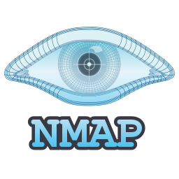
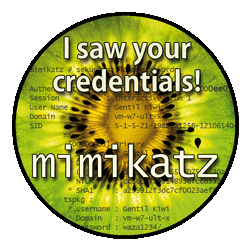

<h1 align="center">Hi 👋, I'm Hajar Ed-darrajy</h1>
<h3 align="center">Cyber Security Engineer</h3>

<!-- 

  

 -->

  

<ul align="left">
  <li>🎓 <b>Cyber Security Engineer</b>, graduated from ENSA Marrakech</li>
  <li>💻 Actively seeking my <b>first professional opportunity</b> as a Cyber Security Engineer, with a strong passion for <b>Offensive Security</b></li>
  <li>🌟 Motivated, results-oriented, and passionate about cybersecurity, with a solid foundation in the field</li>
  <li>🌱 Always eager to learn and grow</li>
  <li>📫 How to reach me: <b>hajareddarrajy@gmail.com</b></li>
</ul>

  

---

<h3 align="center">Connect with me:</h3>

  

---

<h3 align="center">Languages and Tools:</h3>

<table align="center">
  <tr>
    <td align="center" width="90">
       Kali
    </td>
    <td align="center" width="90">
       Bash
    </td>
    <td align="center" width="90">
       Python
    </td>
    <td align="center" width="90">
       Wireshark
    </td>
  </tr>

  <tr>
    <td align="center" width="90">
       Git
    </td>
    <td align="center" width="90">
       C++
    </td>
    <td align="center" width="90">
       C
    </td>
    <td align="center" width="90">
       Nmap
    </td>
  </tr>

  <tr>
    <td align="center" width="90">
       Burp Suite
    </td>
    <td align="center" width="90">
       Metasploit
    </td>
    <td align="center" width="90">
       Mimikatz
    </td>
    <td align="center" width="90">
       GNS3
    </td>
  </tr>

  <tr>
    <td align="center" width="90">
       VMware
    </td>
    <td align="center" width="90">
       VirtualBox
    </td>
    <td align="center" width="90">
       ESXi
    </td>
    <td align="center" width="90">
       Ubuntu
    </td>
  </tr>
</table>

---

  

  

  

 

<h2 align="center">🚀 Explore the projects I've worked on below 👇🏻👇🏻</h2>
